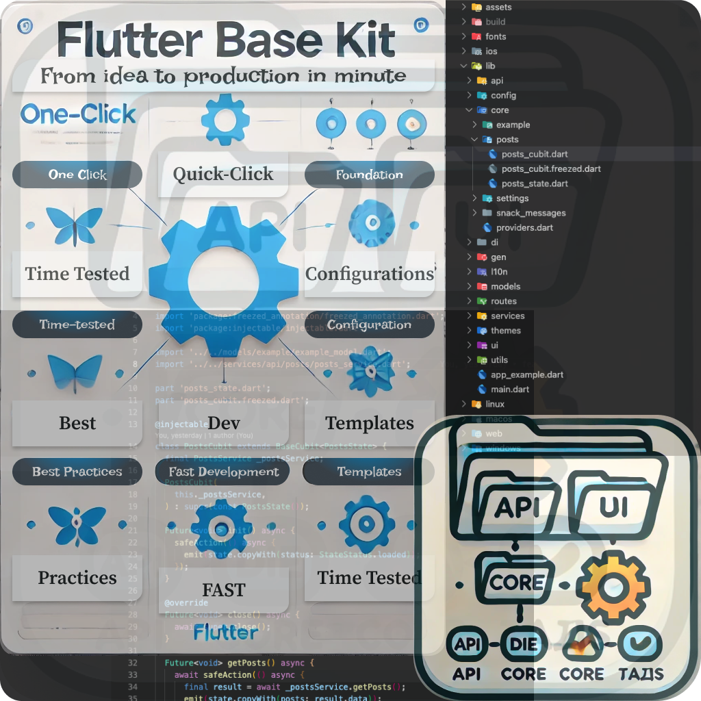

# Flutter Base Kit 🚀

<div align="center">
  
</div>

[](https://pub.dev/packages/flutter_base_kit)

**One-click configuration of project foundation using best practices and time-tested templates**

Create new Flutter applications with pre-configured architecture: routing, DI, networking, localization, theming, and much more.

## Why Flutter Base Kit?

- ⚡ **Quick Start** - don't waste time setting up architecture
- 🏗️ **Ready Structure** - DI, routing, API, themes, localization
- 📱 **Best Practices** - proven architecture from real projects
- 🔧 **CLI Tool** - create projects with a single command

## Installation

### Activate package globally

```bash
dart pub global activate flutter_base_kit
```
<details>
<summary>If command not found</summary>

**Windows:**
- Add to PATH: `%LOCALAPPDATA%\Pub\Cache\bin`

**macOS/Linux:**
- Add to ~/.bashrc or ~/.zshrc: `export PATH="$PATH":"$HOME/.pub-cache/bin"`

📋 If you don't have Dart/Flutter SDK installed

### Windows
1. Download Flutter SDK from [flutter.dev](https://flutter.dev/docs/get-started/install/windows)
2. Extract and add to PATH
3. Run `flutter doctor`

### macOS
```bash
brew install flutter
flutter doctor
```

### Linux
```bash
sudo snap install flutter --classic
flutter doctor
```

</details>

## How to use

### Option 1: Create a new project

```bash
# Create an app
flutter_base_kit create my_app --template app

# Create a package
flutter_base_kit create my_package --template package

# Create a package with tester
flutter_base_kit create my_project --template package+tester
```

### Option 2: Add to existing project

```bash
# Navigate to your project folder
cd my_existing_project

# Initialize Flutter Base Kit
flutter_base_kit init
```

### Option 3: Add new modules to existing project

```bash
# Add a complete module (API → Service → Cubit → Page)
flutter_base_kit module --name user_store
```

## What you get in the project

### 📁 Application structure
```
lib/
├── api/           # API and network requests
├── core/          # Core logic
├── di/            # Dependency injection
├── l10n/          # Localization (EN, ES)
├── models/        # Data models
├── routes/        # Navigation
├── services/      # Services
├── themes/        # Theming
├── ui/            # UI components
└── utils/         # Utilities
```

### 📁 Module structure (created with `module` command)
```
lib/
├── api/retrofit/{module_name}/     # API interface
├── services/api/{module_name}/     # Business logic
├── models/{module_name}/           # Data models
├── core/{module_name}/             # State management
└── ui/pages/app/pages/{module_name}/ # UI page
```

### 🛠️ Ready components
- **Routing** - AutoRoute for navigation
- **DI** - GetIt + Injectable for dependency management
- **API** - Dio + Retrofit for server communication
- **State** - Provider + Bloc for state management
- **Themes** - Flexible theming with light/dark support
- **Localization** - Support for English and Spanish languages
- **Code Generation** - Freezed, JSON, routes are generated automatically

### 🧩 Module Generator
- **Complete Module Creation** - Generate API → Service → Cubit → Page structure
- **Automatic Naming** - Converts snake_case to PascalCase automatically
- **Build Runner Integration** - Automatically runs code generation after module creation

### 🎨 UI Components
- **AppKitLoader** - Global loading widget with customizable presets
- **AppDialog** - Comprehensive dialog system
- **AppSnackBar** - Enhanced snackbar with error, success, and info variants
- **AppBuilder** - Reactive widget builder with built-in loading/error states

## Command examples

```bash
# Create an app
flutter_base_kit create my_app --template app --org com.mycompany

# Create a package
flutter_base_kit create my_package --template package

# Create a monorepo (package + tester)
flutter_base_kit create my_library --template package+tester --org com.mycompany

# Add to existing project
flutter_base_kit init

# Add new module
flutter_base_kit module --name user_store
```


## Next steps

After creating a project:

1. **Navigate to project folder**:
   ```bash
   cd my_app
   ```

2. **Install dependencies**:
   ```bash
   flutter pub get
   ```

3. **Generate code**:
   ```bash
   flutter packages pub run build_runner build
   ```

4. **Run the app**:
   ```bash
   flutter run
   ```


## Useful commands

```bash
# Show help
flutter_base_kit --help

# Generate code (in project)
flutter packages pub run build_runner build --delete-conflicting-outputs

# Create a new module
flutter_base_kit module --name user_store
```

## Template types

- **`app`** - Full Flutter application with all components
- **`package`** - Flutter package/plugin for code reuse
- **`package+tester`** - Package + separate testing application

## Command options

- `--org` - Organization identifier (e.g., com.mycompany)
- `--template` - Template type (app, package, package+tester)
- `--name` - Module name (must be in lowercase or snake_case format, e.g., user, user_store, product_item)
- `--help` - Show help

## Module naming rules

Module name must be in lowercase or snake_case format (e.g., `user`, `user_store`, `product_item`)


## Dependencies

### Core Dependencies

- `flutter_bloc`: State management
- `get_it`: Dependency injection
- `injectable`: Code generation for DI
- `auto_route`: Declarative routing
- `dio`: HTTP client
- `retrofit`: Type-safe HTTP client
- `freezed`: Immutable data classes
- `json_annotation`: JSON serialization
- `flutter_localizations`: Localization support

### Development Dependencies

- `build_runner`: Code generation
- `injectable_generator`: DI code generation
- `auto_route_generator`: Route code generation
- `retrofit_generator`: Retrofit code generation
- `json_serializable`: JSON code generation
- `freezed`: Freezed code generation
- `flutter_gen_runner`: Asset code generation

## Configuration

### Localization

Add ARB files to `lib/l10n/`:
- `app_en.arb` - English translations
- `app_es.arb` - Spanish translations


## Troubleshooting

### Code generation errors

```bash
# Clear cache and regenerate
flutter packages pub run build_runner clean
flutter packages pub run build_runner build --delete-conflicting-outputs
```

## Support

- 📖 **Documentation**: [GitHub](https://github.com/Okladnoj/flutter_base_kit)
- 🐛 **Issues**: [Issues](https://github.com/Okladnoj/flutter_base_kit/issues)
- 📝 **Changelog**: [CHANGELOG.md](CHANGELOG.md)

## Support the project

If you find this package helpful, consider supporting its development:

<div style="display: flex; flex-direction: column; gap: 12px; align-items: start;">

  <a href="https://www.buymeacoffee.com/okji" target="_blank">
    
  </a>

  <a href="https://www.paypal.com/donate?hosted_button_id=NBYVPYB7XDW6A">
    
  </a>

</div>

## License

MIT License - see [LICENSE](LICENSE) file
